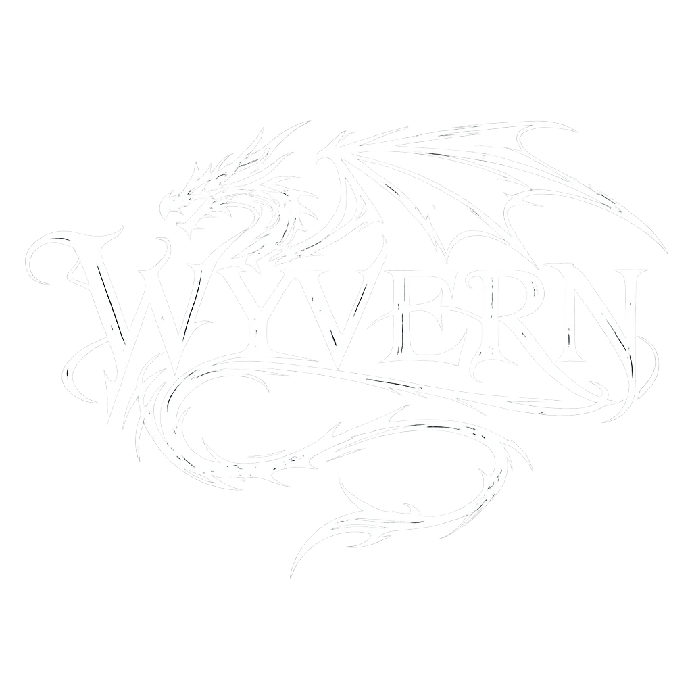

<p align="center">
  
</p>

# Wyvern

AI Agent Orchestrator - a desktop app that lets you coordinate teams of AI agents to execute complex tasks.

You give a directive in plain language. Wyvern breaks it down, spawns AI agents, and orchestrates them in a recursive tree. You stay in the loop as CEO - watching agents work in real time.

## Prerequisites

- **Node.js** 18+
- **npm**
- At least one AI CLI tool installed and on your PATH:
  - [Claude Code CLI](https://docs.anthropic.com/en/docs/claude-code) (`claude`)
  - [Gemini CLI](https://github.com/google-gemini/gemini-cli) (`gemini`)

## Install & Run

```bash
git clone <repo-url>
cd wyvern
npm install
npm run start
```

## Project Setup

A Wyvern project is any directory with a `wyvern.yaml` config and a `.wyvern/roles/` folder containing role definitions.

```
my-project/
├── wyvern.yaml
└── .wyvern/
    └── roles/
        ├── pm.yaml
        ├── backend.yaml
        └── frontend.yaml
```

### wyvern.yaml

The main config file. Lives at the project root.

```yaml
project:
  name: "My App"

# Map of repo aliases to local paths (tilde-expanded).
# Leave empty if agents work in the project directory itself.
repos:
  api: ~/code/my-api
  web: ~/code/my-web

# Files to include in every agent's context.
# Plain paths are relative to the project root.
# Prefix with a repo alias to resolve against that repo.
context_files:
  - brief.md
  - api:README.md
  - web:README.md

execution:
  max_parallel_agents: 4
  timeout_per_agent_minutes: 5
  auto_close_terminals: true
```

| Field | Required | Description |
|-------|----------|-------------|
| `project.name` | yes | Display name shown in the title bar |
| `repos` | yes | Alias-to-path map. Use `{}` if no repos needed |
| `context_files` | no | Files to inject into agent context. Plain paths resolve from project root, `alias:path` resolves from the named repo. Defaults to `[]` |
| `execution.max_parallel_agents` | yes | Max agents running concurrently |
| `execution.timeout_per_agent_minutes` | yes | Kill an agent after this many minutes |
| `execution.auto_close_terminals` | no | Close agent terminal windows when done. Defaults to `true` |

### Role Definitions

Each `.yaml` file in `.wyvern/roles/` defines one agent role. The filename (without extension) becomes the role's **slug** - used in spawn commands and config references.

```yaml
# .wyvern/roles/pm.yaml
description: Receives directives and coordinates work
model:
  provider: claude
  variant: sonnet-4-6
can_spawn: [backend, frontend]
max_depth: 2
entry_point: true
system_prompt: |
  You are a product manager. Break down the directive into
  tasks and spawn the appropriate agents. Review their output
  before marking your work as done.
```

| Field | Required | Description |
|-------|----------|-------------|
| `description` | yes | One-line description (shown in GUI and to parent agents) |
| `model.provider` | yes | CLI command name: `claude`, `gemini`, etc. |
| `model.variant` | yes | Model variant hint (e.g. `sonnet-4-6`, `haiku-4-5`) |
| `can_spawn` | yes | List of role slugs this agent can delegate to. `[]` for leaf agents |
| `max_depth` | yes | Max spawning recursion depth. Must be `>= 1` if `can_spawn` is non-empty, `0` for leaf agents |
| `entry_point` | no | Exactly one role must set this to `true`. This is the first agent spawned |
| `repo` | no | Repo alias from `wyvern.yaml` `repos` map. Sets the agent's working directory |
| `system_prompt` | yes | Instructions given to the agent. Describe its role, goals, and constraints |

**Validation rules:**
- Exactly one role must have `entry_point: true`
- Every slug in `can_spawn` must correspond to an existing role file
- No circular spawn chains (A spawns B spawns A)
- If `can_spawn` is non-empty, `max_depth` must be >= 1

## How Agents Communicate

Agents are stateless CLI processes. They don't share memory - they communicate through file artifacts and two structured commands in their stdout:

### DONE - Complete your task

```
[WYVERN:DONE]
```

Emit this command when the task is finished. Every agent must emit exactly one DONE.

### SPAWN - Delegate to a child agent

```
[WYVERN:SPAWN] role=backend input=backend-task.md
```

Write the task description to a file, then emit SPAWN. Wyvern creates a child agent with the given role and passes it the input file. The parent is re-invoked with the child's results in its context.

## Writing System Prompts

Wyvern automatically injects instructions about SPAWN and DONE into every agent's prompt. Your `system_prompt` should focus on:

1. **What the agent does** - its role and responsibilities
2. **How it should approach work** - coding style, review standards, etc.

You don't need to explain the Wyvern command format - that's handled automatically.

## Using the App

1. **Start Wyvern** - `npm run start`
2. **Open a project** - Click `[Open Project]` and select your project directory (or create a new one)
3. **Check CLI tools** - Wyvern verifies all providers referenced by roles are installed
4. **Enter a directive** - Type your goal in the chat panel and press Enter
5. **Monitor progress** - The Pipeline Tree shows the agent hierarchy. Click an agent to see its logs, artifacts, and config in the Detail Panel
6. **Review results** - When the pipeline completes, check the output artifacts in the Detail Panel

## Troubleshooting

**"No output yet" in logs**
- Verify the CLI tool works manually: `echo "hello" | claude --model claude-sonnet-4-6 -p`
- Check that the provider is on your PATH (Wyvern runs `where`/`which` to check)
- Look at the chat panel for `[stderr]` messages

**Pipeline stuck in Running**
- Check `execution.timeout_per_agent_minutes` - agents are killed after this

**Agent exits without DONE**
- The agent's system prompt should emphasize emitting `[WYVERN:DONE]`

- Check the agent's logs for errors or unexpected output
